# Rate-galaxy-simulation-with-Anomaly-Detection

## [Paper in prep](https://www.overleaf.com/read/ddzwssghsqhy)

## [Presentation Slides](GANomaly_20230321_Zehao.pptx)

## [Glance of this project](#glance-of-this-project-1)

## [Use this project](#use-this-project-1)

# Glance of this project
Code to produce all the plots in the paper/in below is located at [paper_plot.ipynb](paper_plot.ipynb)

## 1. Overview
Train a neural network to reconstruct (original image -> feature space represetation of image -> reconstruct image back) SDSS galaxy images, with only SDSS images as training set. After trained, let the neural network reconstruct galaxy simulation images. The places where the reconstruction fails is the anomaly. The distance in latent space between original images and reconstructed image serves as Anomaly score $\mathcal{A}$. Lower $\mathcal{A}$ means the simulation is closer to SDSS observations.

Here as an example we treat SDSS galaxy RGB ($i$ - $r$ - $g$ band) images as normal set, and detect anomalies in NIHAO simulated galaxies (mock observed in SDSS $i$ - $r$ - $g$ band). This model can be used on any other galaxy simulations without any re-train, can be extended to other surveys other than SDSS or other maps (velocity maps) with re-train.

## 2. Network Architecture - GANomaly ([Samet Akcay et al.](https://arxiv.org/abs/1805.06725))
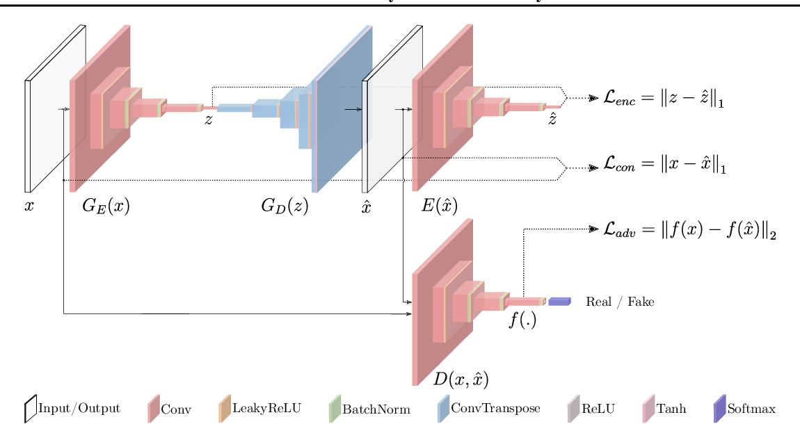

## 3. Gallery  (original galaxy | reconstructed galaxy | residual)
### 3.1. SDSS test set
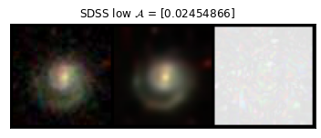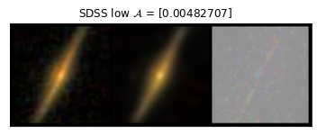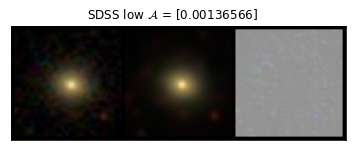
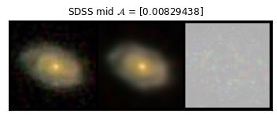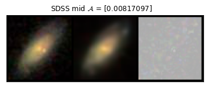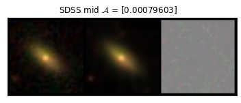
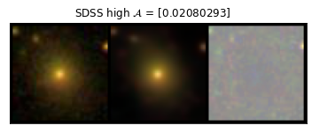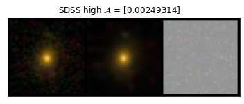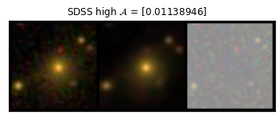
### 3.2. NIHAO simulated galaxies
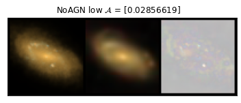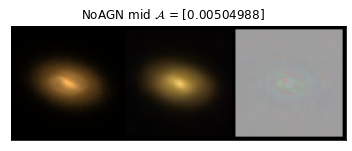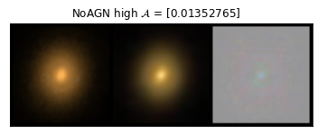
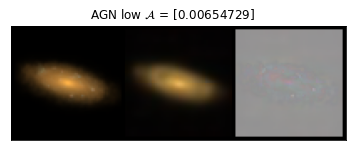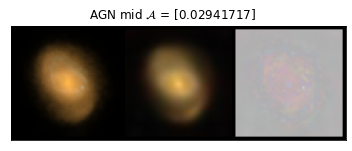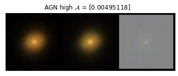
### 3.3. Sanity Check
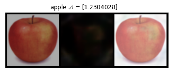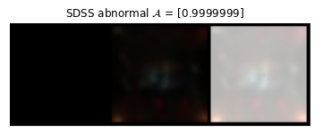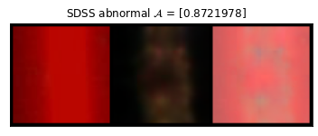

## 4. Anomaly Score Statistics
### 4.1. General
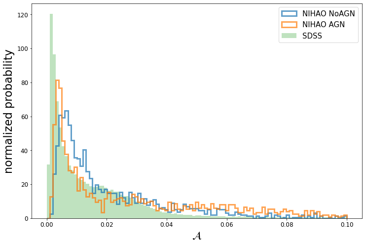
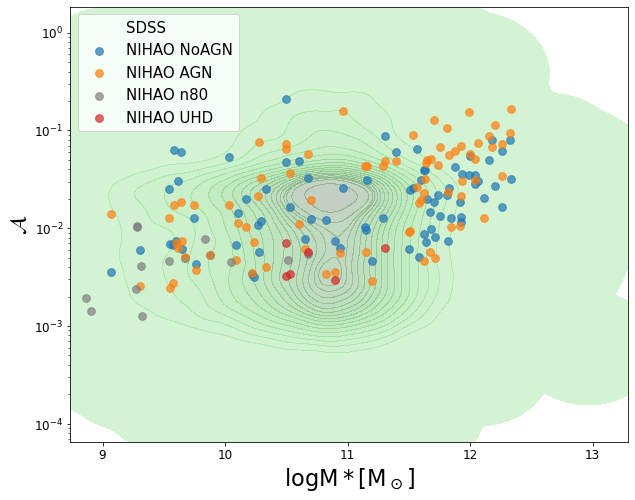
### 4.2. NIHAO AGN vs NIHAO NoAGN
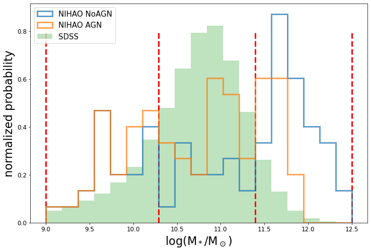
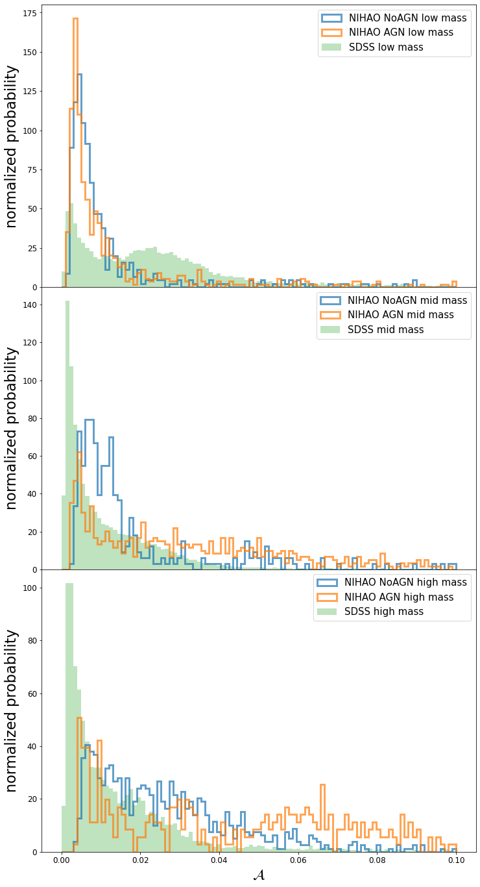
### 4.3. NIHAO n10 vs NIHAO n80 (Tune different star formation threshold parameter)
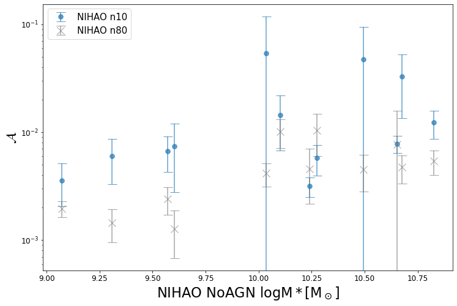
### 4.4. NIHAO UD vs NIHAO UHD (lower vs. higher simulation resolution)
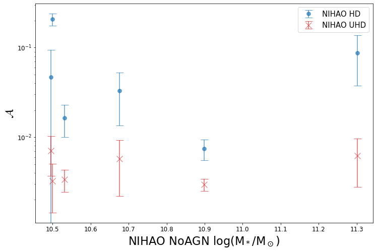
### 4.5. $\mathcal{A}$ vs scaling relation properties
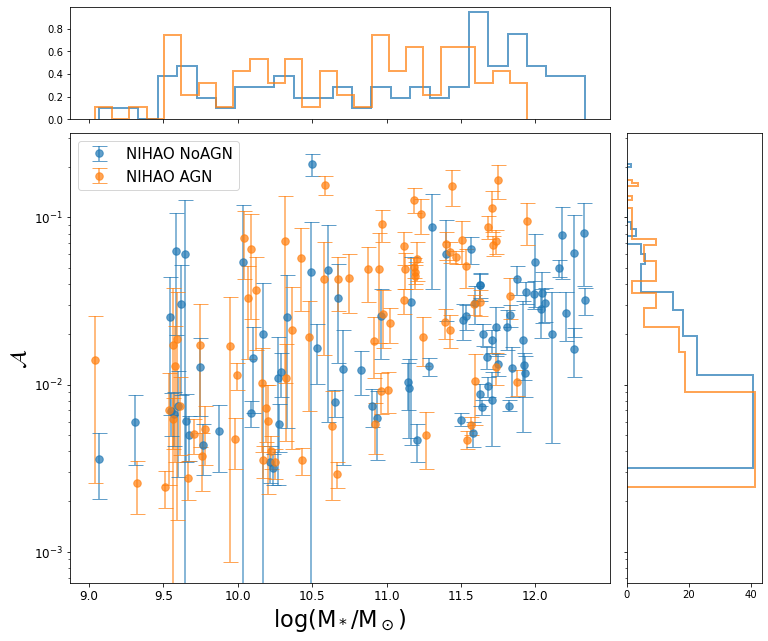
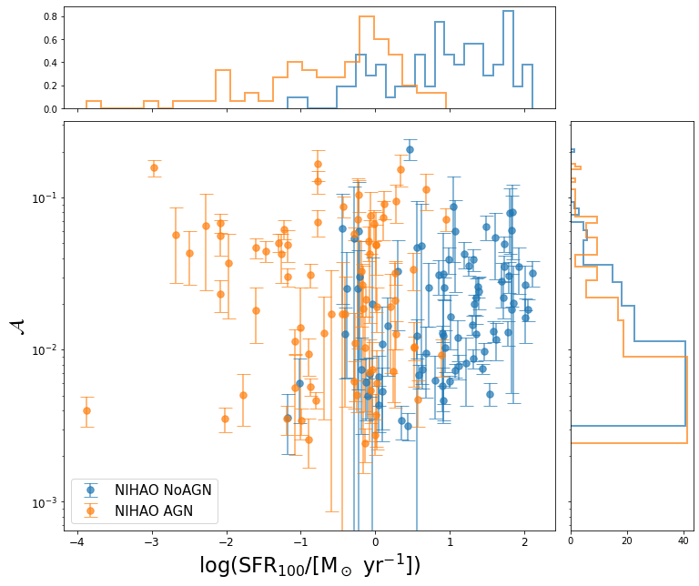
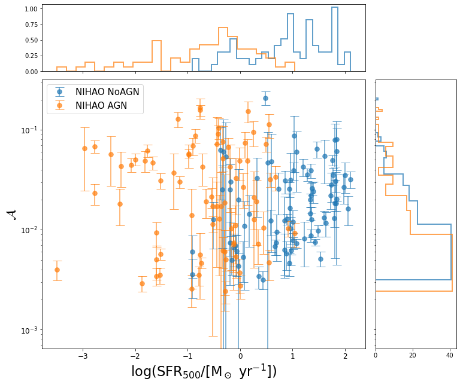
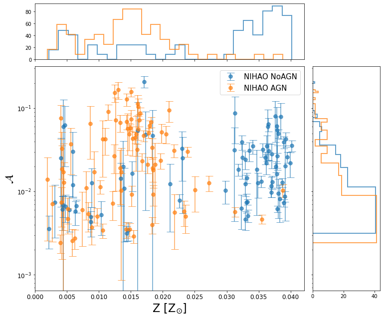
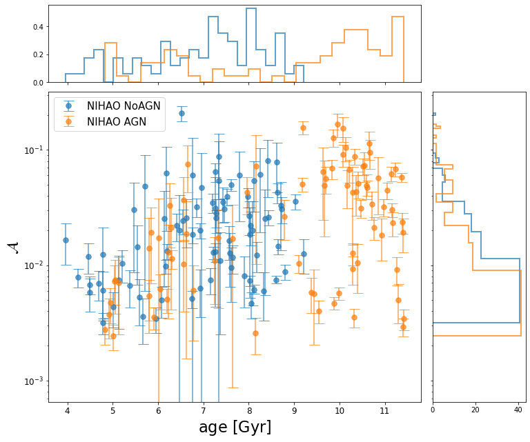
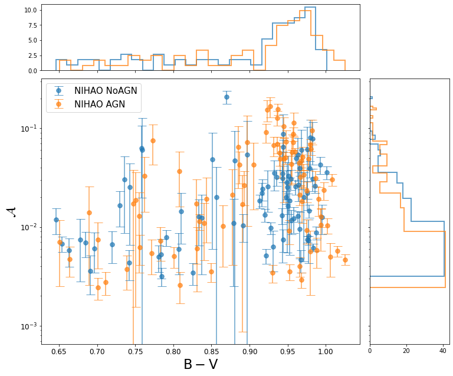
### 4.6. $\mathcal{A}$ vs scaling relations
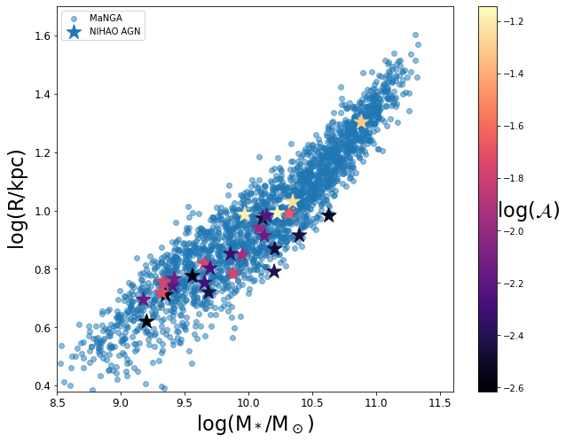
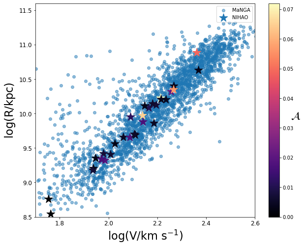
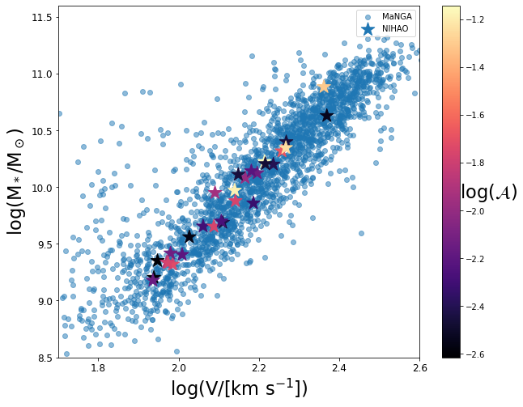

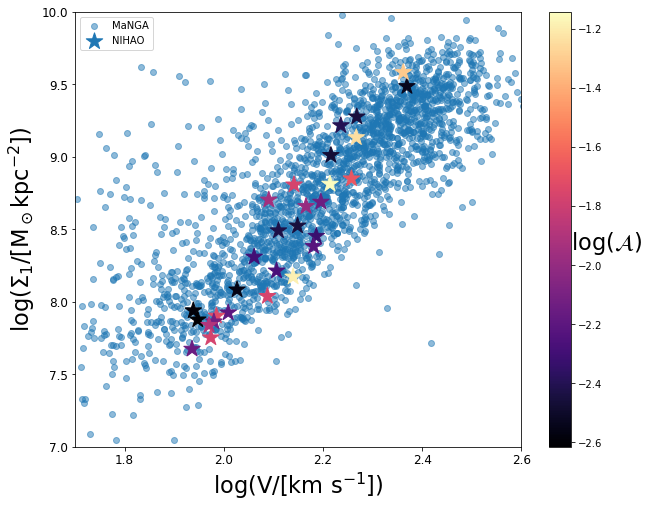

# Use this project

### [Installation](#1-installation)
### [Use the SDSS-trained model described in the paper](#2-use-the-sdss-trained-model-described-in-the-paper)
### [Train your own new model with a new dataset](#3-train-your-own-new-model-with-a-new-dataset)
### [Cite this work](#4-cite-this-work)
 

## 1. Installation
### 1.1. clone this repository to your machine (make sure your machine has a GPU)

    git clone git@github.com:ZehaoJin/Rate-galaxy-simulation-with-Anomaly-Detection.git
    
or

    git clone https://github.com/ZehaoJin/Rate-galaxy-simulation-with-Anomaly-Detection.git

### 1.2. Install dependencies 

- If you already have many Machine Learning/Astro packages installed, maybe (although not recommanded) you can skip this step, and install needed packages when import error appears (`conda install <package-name>`). Some code might need a bit more dependencies than others. Typical packages you will need are pytorch, scikit-learn, astropy, visdom, tqdm, pandas, numpy, matplotlib, etc

- (Recommanded) Create a virtual environment via conda:

      conda create --name ganomaly
    
- Activate the virtual environment:

      conda activate ganomaly

- Install the dependencies:

      conda install -c intel mkl_fft
      pip install --user --requirement requirements.txt
      

## 2. Use the SDSS-trained model described in the paper

- You can use this already trained model to rate ANY simulations -- it's never limted to NIHAO simulations.
- Prepare your SDSS $i-r-g$ band mock observed galaxy images. $3\times 64\times 64$ in size, $i-r-g$ to $R-G-B$.
- Put images you want to test  under folder `data/test/test/1.abnormal/`
- Run jupyter notebook [test.ipynb](test.ipynb), simply run all cells to get anomaly scores and reconstruction plots.
- Or, in terminal, run `python test.py`. The result anomaly score will be saved at output/ganomaly/test/test/anomaly_scores.csv . See the desciptions in [test.py](test.py) for more options.

## 3. Train your own new model with a new dataset

- You shall train GANomaly on different telescopes (other than SDSS), different bands (other than SDSS $i-r-g$), different image size (other than $3\times 64\times 64$), and different maps (velocity maps, density maps, etc), to spot their anomalies.
- Prepare your "normal" set of data, usually from observations. Note they do not strictly have to be all perfectly "normal", but make sure most of them are "normal".
- Copy your data to  `data/<your-dataset-name>` directory, with the following directory & file structure. Note that it's perfectly okay to leave `test/0.normal` and `test/1.abnormal` empty during training.

      <your-dataset-name>
       ├── test
       │   ├── 0.normal
       │   │   └── normal_img_0.png
       │   │   └── normal_img_1.png
       │   │   ...
       │   │   └── normal_img_n.png
       │   ├── 1.abnormal
       │   │   └── abnormal_img_0.png
       │   │   └── abnormal_img_1.png
       │   │   ...
       │   │   └── abnormal_img_m.png
       ├── train
       │   ├── 0.normal
       │   │   └── normal_img_0.png
       │   │   └── normal_img_1.png
       │   │   ...
       │   │   └── normal_img_t.png
       
- In a seperate terminal, run `visdom`, which allows you to visualize the whole training progress.

      python3 -m visdom.server

- Alternatively, you can run visdom in a "virval terminal" with `screen`:

      screen -S <your-session-name>
      python3 -m visdom.server
      
  And `Ctrl+A`,then press `D` to detach that screen session, and leave visdom run in the background. 
  
  You can re-attach to that session by `screen -r <your-session-name>`, check all sessions by `screen -ls`, kill the current attached sesssion by `Ctrl+A`, then press `K`
  
- Start training:

      python train.py                        \
         --dataset <your-dataset-name>       \
         --isize <image-size>                \
         --nc <input image channels>         \
         --nz <size of the latent z vector>  \
         --niter <number-of-epochs>          \

  For more training options, run `python train.py -h`

- Go to your favourite browser, go to address: `localhost:8097` to monitor your training.

- You will find your trained weights, losslog, options log, etc. in `output/`

- To test your trained model, again use [test.ipynb](test.ipynb) or [test.py](test.py). Remember to change the path of weights to your newly trained one, and change options parameters to match the ones you used during training.

- It is almost equivalent to use this repository or [the original GANomaly repository by Samet Akcay et al.](https://github.com/samet-akcay/ganomaly) to train.

## 4. Cite this work
If you use this repository or would like to refer the paper, please use the following BibTeX entry:

It is always nice to cite the original GANomaly paper too:

    @inproceedings{akcay2018ganomaly,
      title={Ganomaly: Semi-supervised anomaly detection via adversarial training},
      author={Akcay, Samet and Atapour-Abarghouei, Amir and Breckon, Toby P},
      booktitle={Asian Conference on Computer Vision},
      pages={622--637},
      year={2018},
      organization={Springer}
    }
